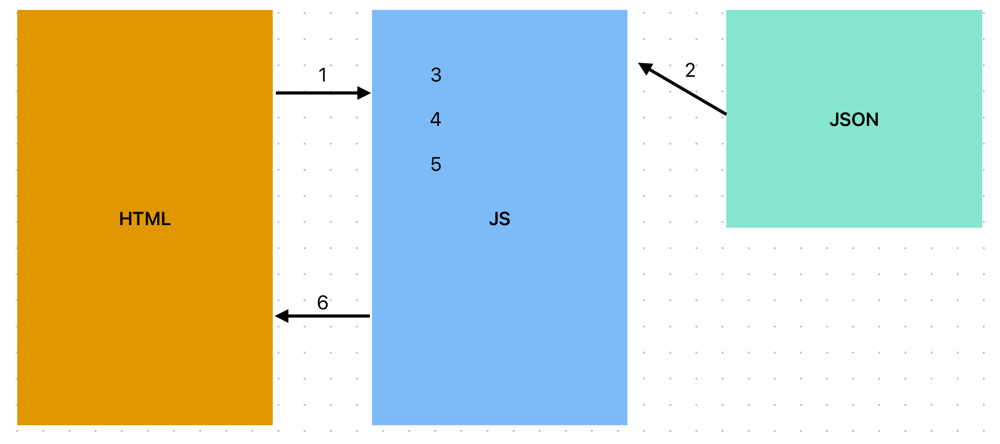
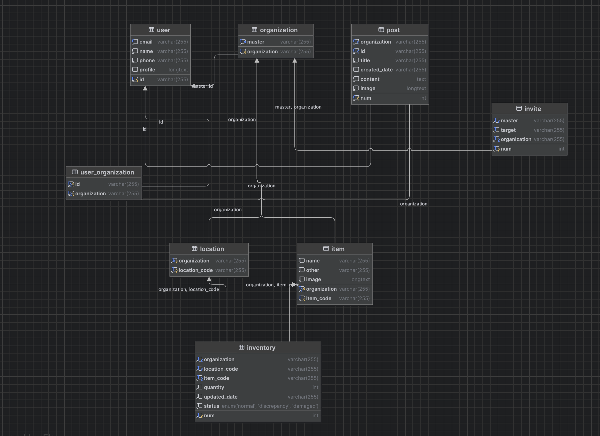

## 프로젝트 설명 요약

+ 목표

이벤트 발생시 요청, 응답, 랜더링방식이 매핑된 JSON 파일을 클라이언트 로직이 참고하여 동작하는
일정한 형식의 구조화된 정의를 통해 기능 추가와 수정이 용이한 물류 관리 웹애플리케이션

+ 기능 

로그인, 게시판, 그룹, 물류관리

+ 구성

언어 : JAVA 21, html, css, javascript
프레임워크 : Spring Boot 3
데이터베이스 : MySQL 8
빌드도구 : Maven, Gradle
호스팅환경 : Raspberry Pi, Ubuntu Linux Server, Docker
기타 구성 : AWS SES, JWT


-------------------------------------------------------------------------------------------------


## 디렉토리 구조 설명

```plaintext
main
├── java
│   └── com
│       └── web
│           └── logistics_management
│               ├── 메인애플리케이션 (logistics_management)
│               ├── function
│               │          ├── board
│               │          ├── group
│               │          ├── logistics
│               │          ├── page
│               │          └── user
│               ├── imutable
│               │          ├── Dto
│               │          ├── Err
│               │          ├── Log
│               │          └── model
│               └── service
│                          ├── board
│                          ├── inviter
│                          ├── item
│                          ├── repository
│                          ├── user
│                          ├── email
│                          └── jwt
└── resources
    ├── static
    │   ├── css
    │   ├── js
    │   └── json
    ├── templates
    │   └── html
    ├── application.yaml
    └── application-local.yml
```


+ fucntion : 컨트롤러와 비즈니스 로직을 기능 단위로 묶은 패키지들의 집합
+ imutable :
           Dto : 모든 요청과 응답을 해당 객체에 담아 전달
           Err : 모든 에러 처리
           Log : 일관된 방식으로 로그를 표시
           model : Dto에 정의할 자료구조
+ service  : 서로 배타적이고 재사용 가능한 로직들


-------------------------------------------------------------------------------------------------


## 프로젝트 구조


+ 로컬 환경과 배포 환경은 같은 공유기를 사용하고 ssh 연결이 되어있다
+ 로컬 환경에서 테스트 후 도커 허브로 푸시
+ 라즈베리 파이에 리눅스 서버 os 설치후 도커 허브의 이미지를 도커 컴포즈 파일 통해 빌드


-------------------------------------------------------------------------------------------------


## 서버 구조


+ 서버에서 클라이언트로 나가는 로그는 필터를 통해 확인
+ 비즈니스 로직은 여러 서비스 로직을 가져와 사용


-------------------------------------------------------------------------------------------------


## 클라이언트



1. 클라이언트 클릭이벤트 감지
2. 클릭한 html요소에서 data-json 값을 가져온다
3. data-json과 일치하는 값을 main.js에서 불러온다
4. 클라이언트 이벤트 실행
5. 요청 전송
6. 응답 확인 후 랜더링


-------------------------------------------------------------------------------------------------


## 데이터베이스 (mysql)



+ 수정중


-------------------------------------------------------------------------------------------------


## Dto


+ main.json의 일부 내용이다
+ url : 작성된 url로 요청을 서버로 보낸다
+ event : do는 실행할 자바스크립트 함수, list는 적용할 html 요소
+ error : 에러 발생시 동작을 정의
+ id_data : 사용자가 클릭한 요소를 구분짓는 값, 예를 들어 게시글에서 여러 게시글 중 하나를 특정할 수 있는 값이다
+ msg : 서버에서 전송받는 메시지
+ req_data : 보낼 데이터
+ res_data : 받을 데이터
+ req_define : 보낼 데이터가 "form" 이라면 폼에서 데이터 추출
+ res_difine : 응답 받은 여러 데이터중 어떤(what) 데이터를 어느 요소에(where) 어떻게 매칭시켜(how) 어떤(way) 방법으로 보낼지 미리 정의


-------------------------------------------------------------------------------------------------


# 로그


+ 필터로 나가는 값을 포착해 로그로 표시
+ req_data,res_data의 데이터중 문자열 길이가 100 이상인 경우 "많은값" 이라고 별도 표기


-------------------------------------------------------------------------------------------------


## 개발방식

1. 기능 정의
2. main.json 작성
3. json파일을 참고해서 요청과 응답에 필요한 db설계와 서비스 로직 작성
4. 작성한 서비스 로직을 활용해 비즈니스 와 컨트롤 로직 작성
5. Swagger UI로 새롭게 작성된 api 테스트
6. 새롭게 추가될 기능을 화면에 표시해줄 html,css 작성하고 자바스크립트 변경은 최소화
7. 로컬 환경에서 테스트
8. 도커 컴포즈 파일로 빌드 후 도커 허브로 push, 리눅스 서버에서 pull
9. 외부 네트워크 환경에서 리눅스 서버로 접속해 테스트


-------------------------------------------------------------------------------------------------


## 예정
+ 그룹 탈퇴시 그룹원 전혀 없을 때 물류 정보 삭제
+ HTTPS 적용, UI반응성 개선, 서버보안검토, 서버성능검토, 게시판 댓글, 물류 관리 기능 추가


-------------------------------------------------------------------------------------------------


## 과정

+ 2024-10-12 : 프로젝트생성, 깃허브연결, 로깅환경 세팅, DB생성, DB연동, 유저기능
+ 2024-10-14 : 그룹기능, 게시글기능
+ 2024-10-15 : 물류기능(백엔드완성)
+ 2024-10-17 : main.json, main.js
+ 2024-10-18 : css,html(클라이언트완성), 테스트
+ 2024-10-19 : 일부기능 수정, 로그 개선, 오류처리 개선
+ 2024-10-20 : 테스트, 도커 빌드 테스트
+ 2024-10-25 : 배포, 도메인 등록


